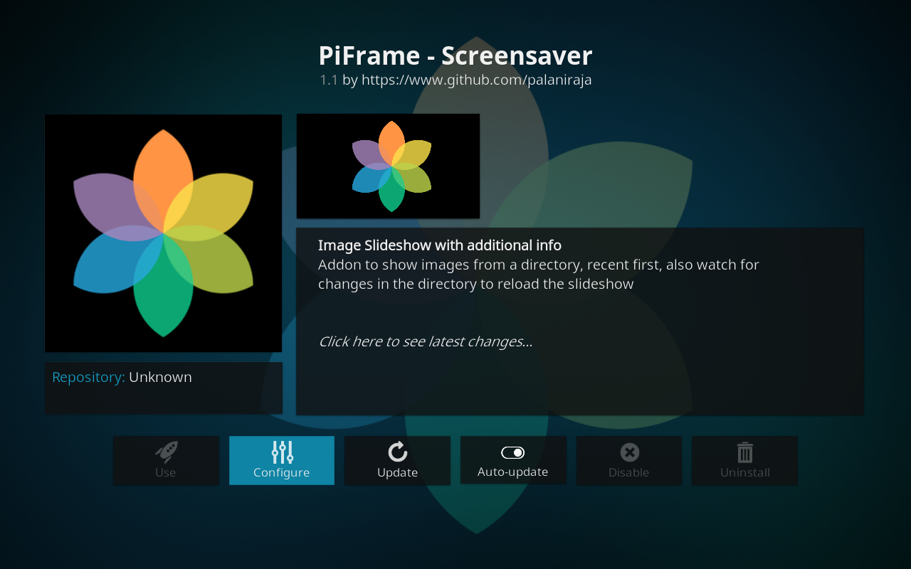

## Kodi/XBMC screensaver addon

A simple screensaver to display pictures of a folder along with EXIF date and Pi CPU temp.

> **NOTE**: This is a part of larger project check branch `complete-package` for complete info

[Download Latest Release - v1.3](https://github.com/palaniraja/piframe/releases)

### Features

* Settings - Filepath, duration of slideshow
* Slideshow
* Display CPU Temp, Total no. of images
* Image with meta label (exif creation date)
* Reload images on changes in dir

### Known issues

* Not happy with meta label placements
* EXIF info takes a long time in RP2, Class 4 SD Card
