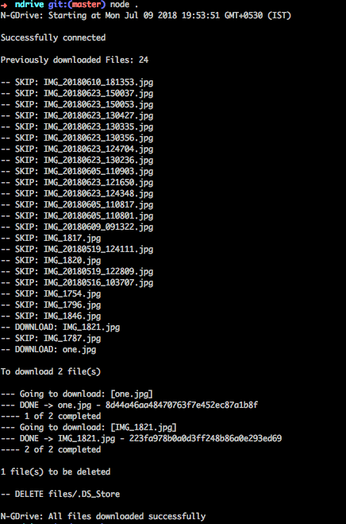

# Node - Google Drive

Download media files (images/videos) from Google Drive folder to a local directory. 

I use this to remotely share new images, so my raspberry pi can download the files and show in kodi running as a Digital Photo Frame.

I wanted to use this with Google Photos only, unfortunately after spending few hours I realized it does not support service account, only OAuth at the moment.

## Features

 * Download files from a Google drive folder using Service Account
 * `md5` of file is used to identify whether it is already downloaded
 * Also remove previously downloaded images from local disk if removed in Google drive

## Usage

## Customization

 * Service account as .json `privatekey.json`
 * Change the `PhotoFrameFolderId` and `DownloadDirectory`
 * Share your Google Drive folder with the client email of your service account. (spent 4 hrs figuring out why it doesnot work)